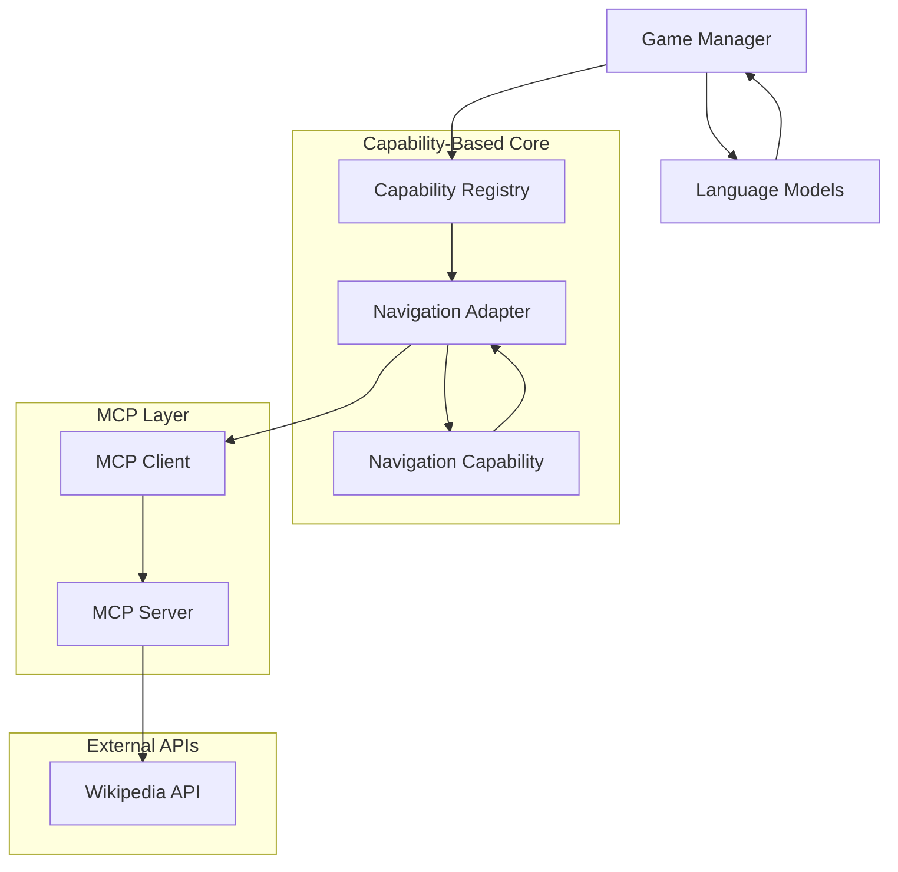
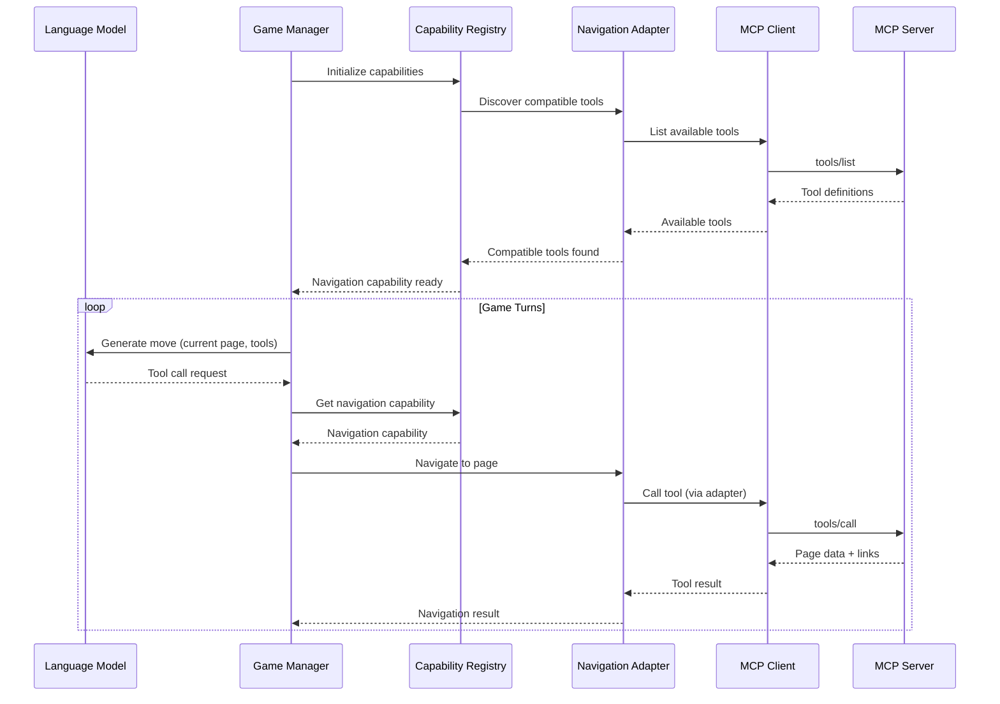
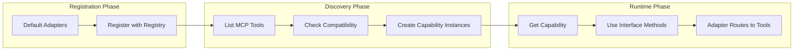
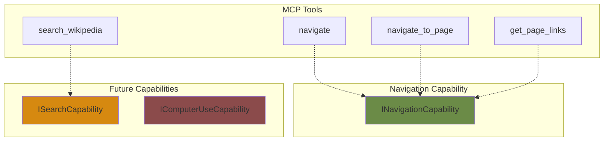
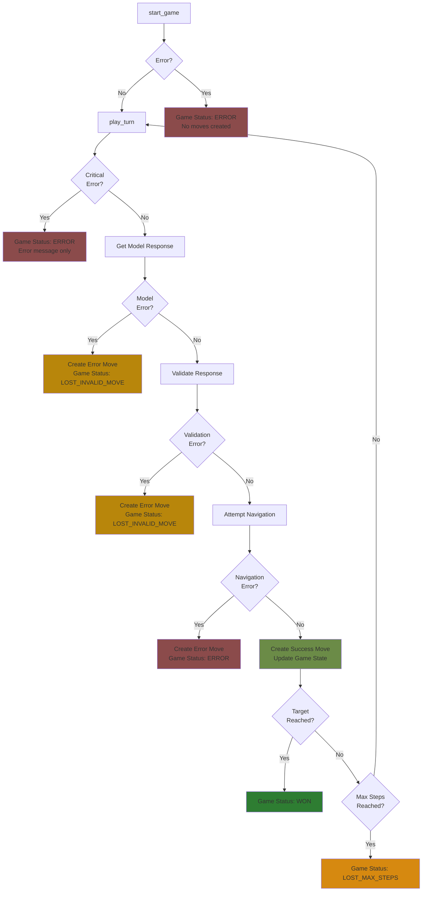
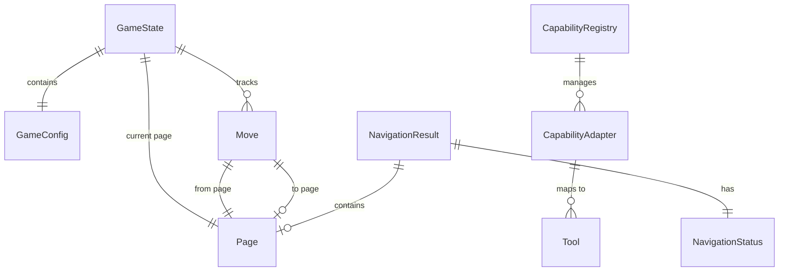
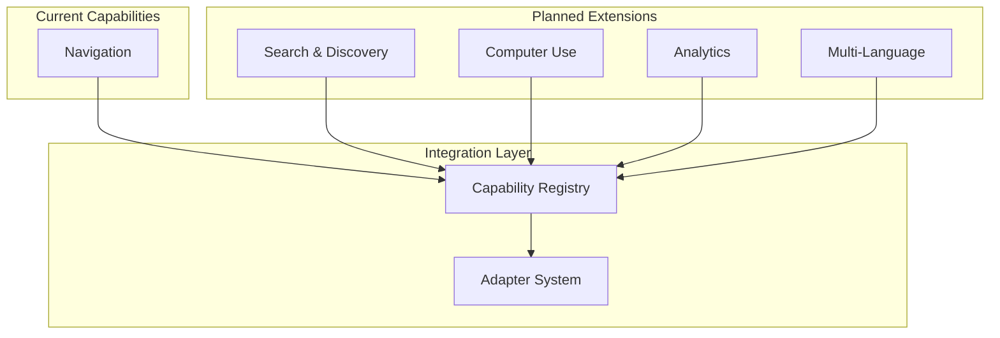
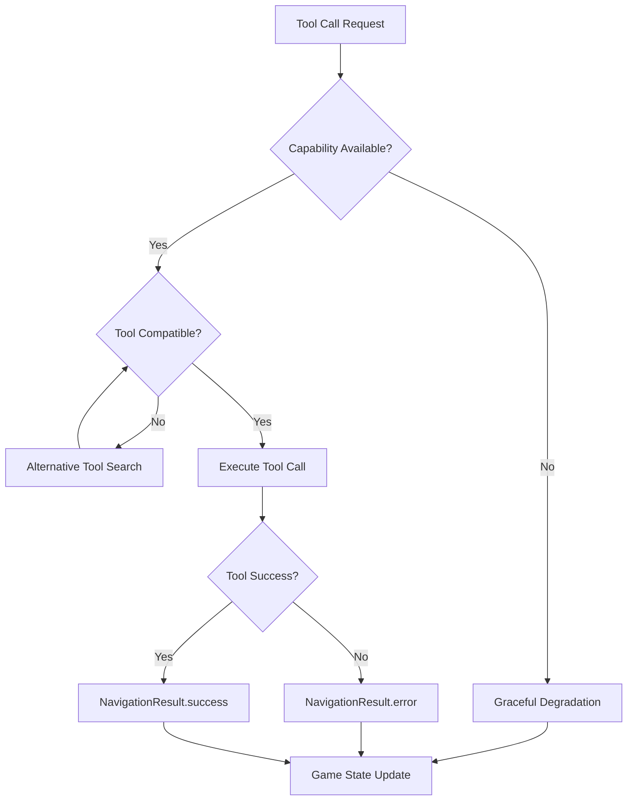

# Wikipedia Arena - Architecture Overview

## System Architecture



## Component Flow



## Key Design Principles

| Principle | Implementation |
|-----------|----------------|
| **Tool Agnosticism** | Adapters map any compatible tool to capabilities |
| **Schema-First** | Interface definitions drive compatibility |
| **Graceful Degradation** | Works with partial tool sets |
| **Separation of Concerns** | Game logic independent of tool implementation |
| **Composability** | Mix and match capabilities dynamically |

## File Structure

```
wiki_arena/
├── capabilities/                 # Capability interfaces
│   ├── navigation.py            # INavigationCapability + NavigationResult
│   └── __init__.py
├── adapters/                    # Tool-to-capability mapping
│   ├── base.py                  # CapabilityAdapter + ToolSignature
│   ├── navigation.py            # NavigationAdapter + NavigationCapabilityImpl
│   └── __init__.py
├── services/                    # Core services
│   ├── capability_registry.py   # CapabilityRegistry
│   └── __init__.py
├── game/                        # Game logic
│   ├── game_manager.py          # GameManager (capability-based)
│   └── __init__.py
├── mcp_client/                  # MCP communication
│   ├── client.py                # MCPClient
│   └── __init__.py
├── language_models/             # LLM providers
│   ├── language_model.py        # Base class
│   ├── anthropic_model.py       # Anthropic implementation
│   ├── openai_model.py          # OpenAI implementation
│   └── random_model.py          # Random implementation
└── data_models/                 # Data structures
    ├── game_models.py           # Game state, moves, results
    └── __init__.py

mcp_server/
└── server.py                    # Wikipedia API server

tests/                           # Comprehensive test suite
├── test_capabilities.py         # Capability interfaces
├── test_adapters.py             # Adapter functionality  
├── test_registry.py             # Registry operations
└── __init__.py
```

## Capability Registry Flow



## Tool Compatibility Matrix



## Migration Phases

| Phase | Status | Description |
|-------|--------|-------------|
| **Phase 1** | ✅ Complete | Capability architecture implementation |
| **Phase 2** | ✅ Complete | GameManager integration |
| **Phase 3** | ✅ Complete | Legacy code removal |
| **Phase 4** | 🎯 Ready | Advanced capabilities (computer-use, search) |

## Game Manager Error Handling Flow

### Error Handling Overview



### Error Categories and Handling

```mermaid
graph TD
    subgraph "Model Errors"
        ME1[MODEL_NO_TOOL_CALL<br/>Model didn't provide tool call]
        ME2[MODEL_INVALID_TOOL<br/>Tool doesn't exist]
        ME3[MODEL_INVALID_LINK<br/>Link not on current page]
        ME4[MODEL_GENERATION_ERROR<br/>Model threw exception]
    end
    
    subgraph "Provider Infrastructure Errors"
        PE1[PROVIDER_RATE_LIMIT<br/>API rate limiting]
        PE2[PROVIDER_TIMEOUT<br/>Request timeout]
        PE3[PROVIDER_API_ERROR<br/>HTTP 5xx errors]
    end
    
    subgraph "Application Errors"
        AE1[APP_CAPABILITY_ERROR<br/>Navigation unavailable]
        AE2[APP_NAVIGATION_ERROR<br/>Navigation failed]
        AE3[APP_UNKNOWN_ERROR<br/>Unexpected exceptions]
    end
    
    subgraph "Error Handling Strategy"
        EHS1[Create Move with Error<br/>Game Status: LOST_INVALID_MOVE]
        EHS2[Create Move with Error<br/>Game Status: ERROR]
        EHS3[No Move Created<br/>Game Status: ERROR]
    end
    
    ME1 --> EHS1
    ME2 --> EHS1
    ME3 --> EHS1
    ME4 --> EHS2
    
    PE1 --> EHS2
    PE2 --> EHS2
    PE3 --> EHS2
    
    AE1 --> EHS3
    AE2 --> EHS2
    AE3 --> EHS2
    
    style ME1 fill:#b8860b
    style ME2 fill:#b8860b
    style ME3 fill:#b8860b
    style ME4 fill:#8b4b4b
    style PE1 fill:#8b4b4b
    style PE2 fill:#8b4b4b
    style PE3 fill:#8b4b4b
    style AE1 fill:#8b4b4b
    style AE2 fill:#8b4b4b
    style AE3 fill:#8b4b4b
```



### Detailed Error Points

| **Phase** | **Error Point** | **Error Type** | **Handling** | **Game Status** | **Move Created?** |
|-----------|----------------|----------------|--------------|-----------------|-------------------|
| **start_game** | Language model init fails | APP_UNKNOWN_ERROR | Set error_message | ERROR | ❌ |
| **start_game** | Capability registry fails | APP_CAPABILITY_ERROR | Set error_message | ERROR | ❌ |
| **start_game** | Navigation capability missing | APP_CAPABILITY_ERROR | Set error_message | ERROR | ❌ |
| **start_game** | Initial page navigation fails | APP_NAVIGATION_ERROR | Set error_message | ERROR | ❌ |
| **play_turn** | No language model | - | Set error_message | ERROR | ❌ |
| **play_turn** | No navigation capability | - | Set error_message | ERROR | ❌ |
| **play_turn** | Model generation fails (rate limit) | PROVIDER_RATE_LIMIT | Create error move | ERROR | ✅ |
| **play_turn** | Model generation fails (timeout) | PROVIDER_TIMEOUT | Create error move | ERROR | ✅ |
| **play_turn** | Model generation fails (API error) | PROVIDER_API_ERROR | Create error move | ERROR | ✅ |
| **play_turn** | Model generation fails (other) | MODEL_GENERATION_ERROR | Create error move | ERROR | ✅ |
| **play_turn** | No tool call in response | MODEL_NO_TOOL_CALL | Create error move | LOST_INVALID_MOVE | ✅ |
| **play_turn** | Tool doesn't exist | MODEL_INVALID_TOOL | Create error move | LOST_INVALID_MOVE | ✅ |
| **play_turn** | Empty tool arguments | MODEL_INVALID_TOOL | Create error move | LOST_INVALID_MOVE | ✅ |
| **play_turn** | Link not on current page | MODEL_INVALID_LINK | Create error move | LOST_INVALID_MOVE | ✅ |
| **play_turn** | Navigation execution fails | APP_NAVIGATION_ERROR | Create error move | ERROR | ✅ |
| **play_turn** | Unexpected exception | APP_UNKNOWN_ERROR | Create error move | ERROR | ✅ |


### Error Metadata Examples

```json
{
  "MODEL_INVALID_LINK": {
    "requested_page": "Machine Learning",
    "current_page": "Artificial Intelligence", 
    "is_target_page": false,
    "available_links_count": 156,
    "tool_call": {
      "name": "navigate",
      "arguments": {"page": "Machine Learning"}
    }
  },
  "PROVIDER_RATE_LIMIT": {
    "exception_type": "RateLimitError",
    "step": 3,
    "has_tool_call_request": false,
    "provider": "anthropic"
  },
  "APP_NAVIGATION_ERROR": {
    "target_page": "Philosophy",
    "nav_error": "Page not found",
    "navigation_capability": "text_based"
  }
}
```

## Data Model Relationships



## Performance Characteristics

| Metric | Value | Notes |
|--------|-------|-------|
| **Test Coverage** | 29/29 tests pass | Full capability stack tested |
| **Tool Discovery** | ~100ms | Cached after initialization |
| **Page Navigation** | ~1-2s | Depends on Wikipedia API |
| **Link Extraction** | 500-2000 links | Automatic pagination |
| **Memory Usage** | Low | Stateless capability design |

## Extension Points



## Tool Parameter Mapping

| Language Model Tool Call | Adapter Mapping | MCP Server Tool |
|--------------------------|------------------|-----------------|
| `navigate_to_page(page_title="X")` | `page_title` → `page` | `navigate(page="X")` |
| `navigate(page="X")` | Direct mapping | `navigate(page="X")` |
| `search(query="X")` | Future mapping | `search_wikipedia(query="X")` |

## Error Handling Strategy



## Testing Strategy

| Test Category | Coverage | Purpose |
|---------------|----------|---------|
| **Unit Tests** | Capabilities, Adapters | Interface compliance |
| **Integration Tests** | Registry, Tool discovery | Component interaction |
| **End-to-End Tests** | Full game flow | System validation |
| **Compatibility Tests** | Tool mapping scenarios | Graceful degradation | 