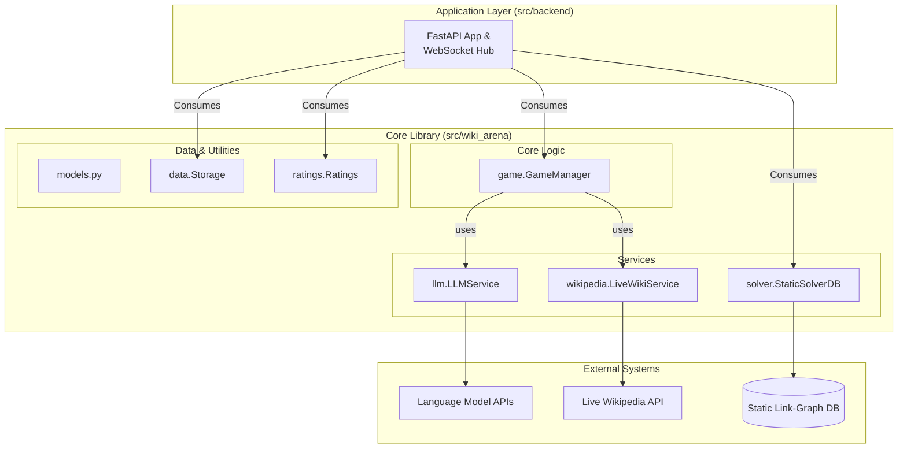
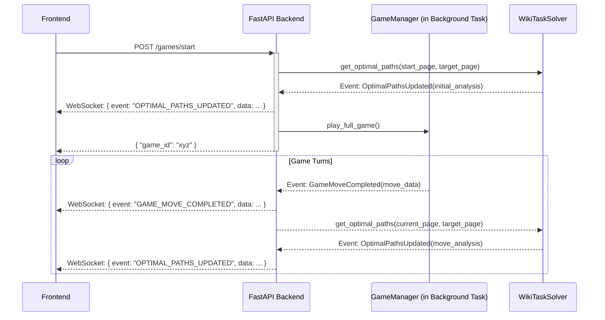
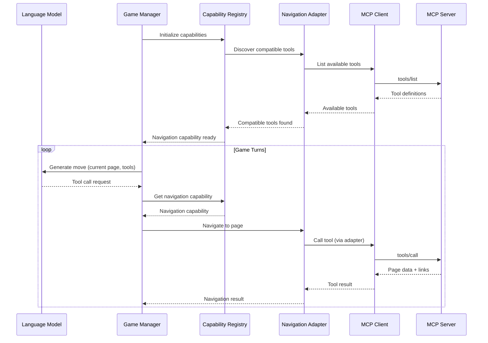

# Wiki Arena - Architecture v2: Simplified & UX-Focused

This document outlines the v2 architecture for the Wiki Arena application. The design prioritizes simplicity, clear separation of concerns, and a highly responsive user experience by decoupling core game logic from real-time task solver.

## 1. Guiding Principles

- **Simplicity & Decoupling:** Components have a single, well-defined responsibility. Communication is through direct, in-process calls within the core library, eliminating unnecessary network layers and complexity.
- **Single Source of Truth:** Data access for a specific domain (e.g., live Wikipedia content, static graph analysis) is centralized in a single service.
- **Optimized for User Experience:** The architecture is explicitly designed to prevent blocking operations from impacting the frontend. Game progression is shown instantly, with richer analytical data layered on top asynchronously.

## 2. High-Level System Architecture

The system is divided into three distinct layers: a self-contained **Core Library** (`wiki_arena`), a web-facing **Application Layer** (`backend`), and **External Systems**.



## 3. The `wiki_arena` Core Library

This is a standalone Python package containing all the logic required to run and analyze a game. It has no dependency on the `backend` web application.

### Proposed Directory Structure

```
src/
└── wiki_arena/
    ├── __init__.py
    ├── models.py              # ALL core Pydantic models (GameState, Move, Page, etc.)
    │
    ├── utils/
    │   └── wiki_helper.py      # Common utilities (e.g., wiki title sanitization)
    │
    ├── game/
    │   └── manager.py         # The simplified GameManager
    │
    ├── llm/
    │   ├── service.py         # The LLMService facade
    │   └── providers.py       # OpenAI, Anthropic, etc. implementations
    │
    ├── wikipedia/
    │   └── live_service.py    # LiveWikiService for page content/links
    │
    ├── solver/
    │   └── static_db.py       # StaticSolverDB for graph analysis
    │
    ├── data/
    │   ├── repository.py
    │   └── storage.py
    │
    └── ratings/
        ├── bradley_terry.py
        └── leaderboard_generator.py
```

### Key Components

- **`game.GameManager`**:
  - **Responsibility:** Executes the turn-by-turn logic of a single game.
  - **Dependencies:** `LiveWikiService` (to get page data) and `LLMService` (to get the model's next move).
  - **Key Logic:** It receives a page from the `LiveWikiService`, passes the content to the `LLMService`, receives a chosen link back, and validates that link against the list of links provided by the `LiveWikiService`. It has **no knowledge** of the solver or optimal paths.

- **`wikipedia.LiveWikiService`**:
  - **Responsibility:** The sole gateway to the live Wikipedia API.
  - **Methods:**
    - `get_page(title: str) -> Page`: Fetches the content for a given page title from the live API and parses it to return a `Page` object containing both its text and a complete list of links found on that page. This is crucial for game logic and validation.

- **`solver.StaticSolverDB`**:
  - **Responsibility:** The sole gateway to the hyper-optimized `wiki_graph.sqlite` database. Its purpose is purely analytical.
  - **Methods:**
    - `get_shortest_path_length(from_title: str, to_title: str) -> int`: Returns the number of steps in the optimal path between two pages.
    - This service is completely independent of the `GameManager` and `LiveWikiService`.

- **`models.py`**:
  - **Responsibility:** A single, central file defining all core Pydantic data models (`GameState`, `GameResult`, `Page`, `Move`).
  - **Benefit:** This creates a canonical, easily discoverable source for the "shape" of the application's data, simplifying development and debugging.


## 4. The `backend` Application Layer & Event Flow

The `backend` is a consumer of the `wiki_arena` library. It exposes the library's functionality over a web interface using **event-driven architecture**.

### Backend Directory Structure

```
src/backend/
├── main.py                      # FastAPI app + EventBus setup
├── config.py                    # Configuration management
├── dependencies.py              # Dependency injection (EventBus, GameCoordinator)
│
├── api/                         # HTTP endpoints
│   ├── games.py                # Game management REST API
│   └── solver.py               # Path solving endpoints
│
├── models/                      # API data models
│   └── api_models.py           # Request/response Pydantic models
│
├── coordinators/               # Business orchestration
│   └── game_coordinator.py    # Game lifecycle management
│
├── handlers/                   # Event handlers (stateless & reactive)
│   ├── websocket_handler.py   # WebSocket broadcasting
│   └── optimal_path_handler.py # Parallel optimal task solver
│
└── websockets/                 # Real-time communication
    └── game_hub.py            # WebSocket connection management
```

### Key Backend Components

- **`coordinators/game_coordinator.py`**: Manages game lifecycles, orchestrates between core library and web layer, handles background execution
- **`handlers/websocket_handler.py`**: Reacts to game events and broadcasts updates to WebSocket clients
- **`handlers/optimal_path_handler.py`**: Triggers parallel optimal task solver in response to game events
- **`websockets/game_hub.py`**: Manages WebSocket connections and broadcasting infrastructure

### Live Viewing Experience: The Event-Driven Flow

To provide a fluid, real-time viewing experience, the backend uses an event-driven, non-blocking architecture.



1.  **Start Game Request:** The `POST /games/start` API call arrives.
2.  **Initial Optimal Paths:** The backend **immediately** calls the `WikiTaskSolver` with the start and target pages. The solver calculates the initial optimal paths and notifies the backend, which pushes a `OPTIMAL_PATHS_UPDATED` event to the frontend. This allows the UI to render the optimal path guides before the game even starts.
<!-- 3.  **Start Game Execution:** The backend starts the `GameManager` in a **background task** and returns an HTTP response with the `game_id` **immediately**. The user is not blocked. -->
4.  **Move Completed:** When the `GameManager` completes a move, it notifies the backend, which instantly pushes a `GAME_MOVE_COMPLETED` event to the frontend via WebSockets. The frontend can draw the new move. (the next node is drawn on the graph, but the optimal paths are not updated until the solver is done)
5.  **Parallel Optimal Paths Update:** Simultaneously, the backend tells the `WikiTaskSolver` to analyze the new move. This happens in parallel and does not block the game.
6.  **Optimal Paths Update Ready:** When the `WikiTaskSolver` finishes, it notifies the backend, which then pushes another `OPTIMAL_PATHS_UPDATED` event. The frontend receives this and updates the UI with the new data (e.g., coloring the most recent move node based on the optimal path length before and after the move, showing new optimal routes).

**This ensures the UI is never waiting for a slow operation.** The perceived performance is excellent.

## 5. Architectural Decisions & Alternatives

#### Decision: Decoupling Gameplay (`GameManager`) from task solver (`SolverService`)
- **Why:** The core game logic (navigating from page A to B) is independent of the analysis of *how well* that navigation was performed. Decoupling them means the game's execution is never blocked by potentially slow pathfinding calculations. This directly results in a more responsive and robust system.
- **Alternative Considered:** A tightly coupled `GameManager` that calculates the optimal path after every move.
- **Why Not Pursued:** This would introduce noticeable lag on the frontend after every single move, creating a poor user experience. It also unnecessarily complicates the `GameManager`'s responsibilities.

<!-- #### Decision: Direct Service Calls over MCP (Model Context Protocol)
- **Why:** For a self-contained application where all components run in the same process, direct Python method calls are significantly simpler, faster, and easier to test than a network-based abstraction like MCP. The goal of standardizing LLM tool-call outputs can be achieved more simply within an `LLMService` facade.
- **Alternative Considered:** Keeping the MCP client/server architecture.
- **Why Not Pursued:** While powerful for distributed, polyglot systems, MCP introduces a network hop, a separate server process to manage, and significant testing complexity, all of which are unnecessary for the current scope. It's a classic case of "You Ain't Gonna Need It" (YAGNI). -->

#### Decision: Two Distinct Wikipedia Services (`LiveWikiService` vs. `StaticSolverDB`)
- **Why:** The two services interact with fundamentally different data sources (a live web API vs. a local, optimized SQLite DB) for different purposes (rich content vs. graph structure). Separating them follows the Single Responsibility Principle and allows each to be optimized and tested independently.
- **Alternative Considered:** A single, unified `WikipediaService`.
- **Why Not Pursued:** This would merge two very different concerns. The logic for handling network requests, rate limiting, and HTML parsing is completely different from the logic for high-speed local database queries. A unified service would become a complex monolith. 


#  Components

## Game Manager

#### Game Manager


