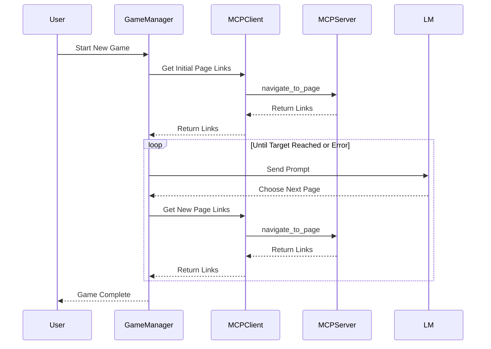
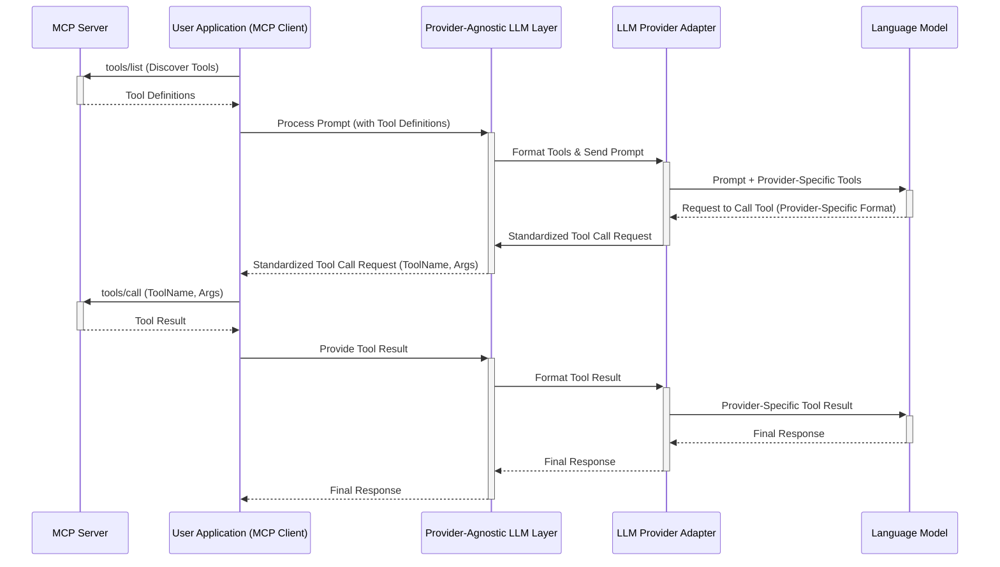

# main

```
┌─────────────────┐    ┌─────────────────┐    ┌─────────────────┐
│   Game Client   │    │  Game Manager   │    │   MCP Client    │
│                 │────│                 │────│                 │
│ - UI/Interface  │    │ - Game Logic    │    │ - Tool Calls    │
│ - User Input    │    │ - State Mgmt    │    │ - Session Mgmt  │
└─────────────────┘    └─────────────────┘    └─────────────────┘
                                │                       │
                                │                       │
                       ┌─────────────────┐    ┌─────────────────┐
                       │ Tool Handler    │    │   MCP Server    │
                       │   Registry      │    │                 │
                       │ - Tool Routing  │    │ - Wikipedia API │
                       │ - Result Parse  │    │ - Tool Impl     │
                       └─────────────────┘    └─────────────────┘
```



# application = client (all communication is JSON-RPC)

