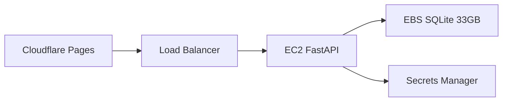

# Wiki Arena - AWS Deployment

## Stack
- Frontend: Vanilla TypeScript + Vite (static files)
- Backend: FastAPI + WebSocket (real-time games)
- Database: 33GB read-only SQLite (bi-monthly refresh)

## Architecture

## Options

**MVP**: Single EC2 + EBS in us-east-2 (~$50/month)
**Production**: Multi-AZ with ALB (~$100/month)

## Components
- **Cloudflare Pages**: Free static hosting + CDN
- **EC2**: t3.micro for FastAPI + WebSocket
- **EBS**: gp3 volume for 33GB SQLite
- **Secrets Manager**: API keys (Anthropic, OpenAI, OpenRouter)