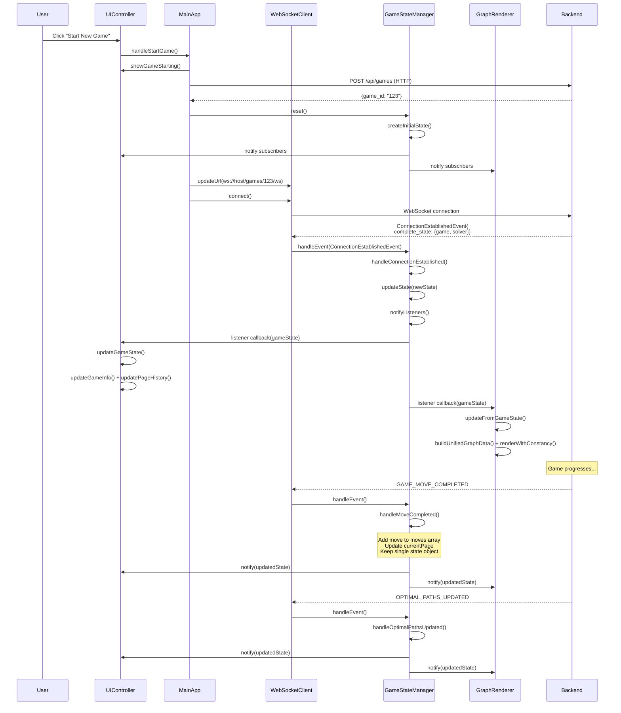

```mermaid
sequenceDiagram
    participant User
    participant UIController
    participant MainApp
    participant WebSocketClient
    participant GameStateManager
    participant GraphRenderer
    participant Backend

    User->>UIController: Click "Start New Game"
    UIController->>MainApp: handleStartGame()
    MainApp->>UIController: showGameStarting()
    MainApp->>Backend: POST /api/games (HTTP)
    Backend-->>MainApp: {game_id: "123"}
    
    MainApp->>GameStateManager: reset()
    GameStateManager->>GameStateManager: createInitialState()
    GameStateManager->>UIController: notify subscribers
    GameStateManager->>GraphRenderer: notify subscribers
    
    MainApp->>WebSocketClient: updateUrl(ws://host/games/123/ws)
    MainApp->>WebSocketClient: connect()
    WebSocketClient->>Backend: WebSocket connection
    
    Backend-->>WebSocketClient: ConnectionEstablishedEvent{<br/>complete_state: {game, solver}}
    WebSocketClient->>GameStateManager: handleEvent(ConnectionEstablishedEvent)
    GameStateManager->>GameStateManager: handleConnectionEstablished()
    GameStateManager->>GameStateManager: updateState(newState)
    GameStateManager->>GameStateManager: notifyListeners()
    
    GameStateManager->>UIController: listener callback(gameState)
    UIController->>UIController: updateGameState()
    UIController->>UIController: updateGameInfo() + updatePageHistory()
    
    GameStateManager->>GraphRenderer: listener callback(gameState)
    GraphRenderer->>GraphRenderer: updateFromGameState()
    GraphRenderer->>GraphRenderer: buildUnifiedGraphData() + renderWithConstancy()
    
    Note over Backend: Game progresses...
    Backend-->>WebSocketClient: GAME_MOVE_COMPLETED
    WebSocketClient->>GameStateManager: handleEvent()
    GameStateManager->>GameStateManager: handleMoveCompleted()
    
    Note over GameStateManager: Add move to moves array<br/>Update currentPage<br/>Keep single state object
    
    GameStateManager->>UIController: notify(updatedState)
    GameStateManager->>GraphRenderer: notify(updatedState)
    
    Backend-->>WebSocketClient: OPTIMAL_PATHS_UPDATED
    WebSocketClient->>GameStateManager: handleEvent()
    GameStateManager->>GameStateManager: handleOptimalPathsUpdated()
    GameStateManager->>UIController: notify(updatedState)
    GameStateManager->>GraphRenderer: notify(updatedState)
```

# Coupling with backend

```mermaid
graph TD
    subgraph "Frontend Component Architecture"
        A[WikiArenaApp - Main Orchestrator]
        B[GameStateManager - Single Source of Truth]
        C[WebSocketClient - Real-time Communication]
        D[UIController - DOM Updates]
        E[GraphRenderer - D3.js Visualization]
        
        A --> B
        A --> C
        A --> D
        A --> E
    end
    
    subgraph "Event Flow Wiring"
        F[WebSocket Events] --> G[GameStateManager.handleEvent]
        G --> H[State Update - Mutation]
        H --> I[Observer Notifications]
        I --> J[UIController Listener]
        I --> K[GraphRenderer Listener]
        
        J --> L[DOM Updates]
        K --> M[Graph Visualization Updates]
    end
    
    subgraph "WebSocket Event Types"
        N[connection_established] --> O[Complete game state]
        P[GAME_STARTED] --> Q[Initial game setup]
        R[GAME_MOVE_COMPLETED] --> S[Add move to history]
        T[OPTIMAL_PATHS_UPDATED] --> U[Update path analysis]
        V[GAME_FINISHED] --> W[Final game status]
    end
    
    subgraph "Backend Coupling Points"
        X[Backend WebSocket Handler] --> Y[Sends structured events]
        Y --> Z[Frontend processes via handleEvent router]
        AA[Backend Game Models] --> BB[Define data structure]
        BB --> CC[Frontend TypeScript types mirror these]
    end
```